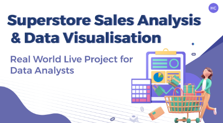
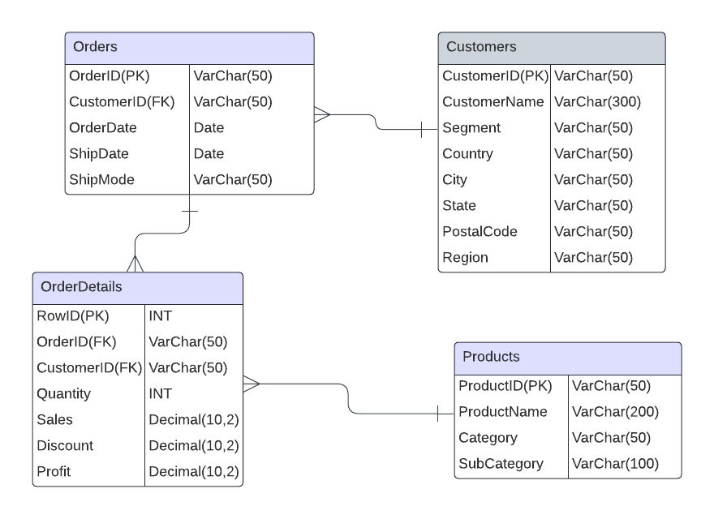
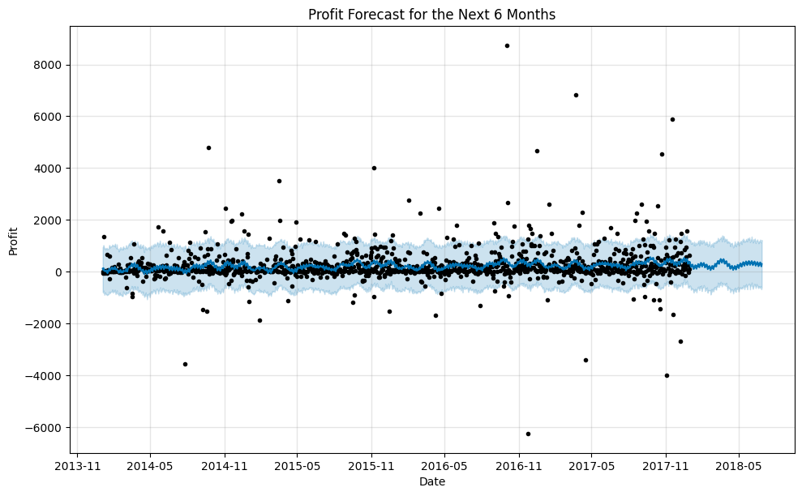
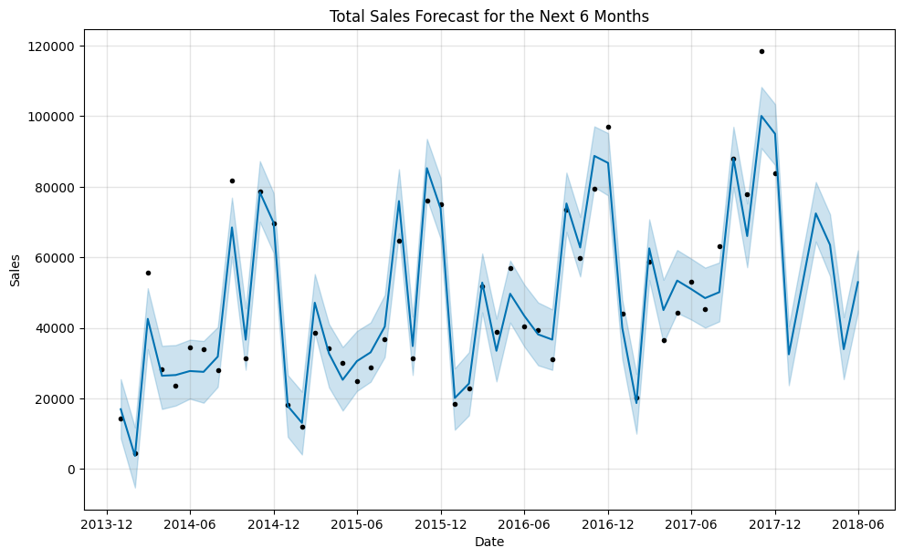

# Super-Store-Data-Analysis-and-Visualization
## Project Overview

Superstore is a fictional retail company based in the United States. They specialize in selling furniture, office supplies, and technology products.This project focuses on analyzing sales performance, customer segmentation, profitability, shipping performance, and forecasting using a superstore's dataset. Additionally, data modeling, validation, governance, and outlier analysis were conducted to ensure accurate results and insights.

## Objectives
- Data Understanding: Analyze and understand the dataset structure, including key variables and relationships.
  
- Data Cleaning: Handle missing values, outliers, and ensure the data is accurate for analysis.
  
- Exploratory Data Analysis (EDA): Perform EDA to gain initial insights and spot trends.
  
- Data Visualization: Create dashboards and visual representations to communicate findings.
  
- Insights & Recommendations: Based on the analysis, provide actionable insights and recommendations.

## Dashboards
### You can directly access interactive dashboaeds: 
[Profit](https://public.tableau.com/app/profile/nada.hamdi/viz/SuperStoreAnalysis-Profit/Profit?publish=yes)
[Profit Margin](https://public.tableau.com/app/profile/nada.hamdi/viz/SuperStoreAnalysis-ProfitMargin/profitmargin?publish=yes)
[Sales](https://public.tableau.com/app/profile/nada.hamdi/viz/SuperStoreAnalysis-Sales/Sales?publish=yes)
[Customer](https://public.tableau.com/app/profile/nada.hamdi/viz/SuperStoreAnalysis-Customers/Customers?publish=yes)
[Shipping](https://public.tableau.com/app/profile/nada.hamdi/viz/SuperStoreAnalysis-Shipping/Shipping?publish=yes)
[Discount](https://public.tableau.com/app/profile/nada.hamdi/viz/SuperStoreAnalysis-Discounts/Discount?publish=yes)
[Trends dashboard](https://public.tableau.com/app/profile/mohamed.fareed4903/viz/Book1_17285517907770/SalesDashboard?publish=yes)
## Dataset
The dataset used for this project comes from a superstore's sales records and contains 9994 transactions that occurred from 2014 to 2017.  This dataset encompasses a wide range of information, including order specifics, geographical data, and product-related data, offering insights into operations, customer behavior, profitability, and logistics.
### Columns Overview:
- **Row ID**: Unique identifier for each record (Quantitative).
  
- **Order ID**: Unique identifier for each order (Qualitative).
  
- **Order Date**: Date when the order was placed (Qualitative).
  
- **Ship Date**: Date when the order was shipped (Qualitative).
  
- **Ship Mode**: Shipping method (e.g., Standard Class, First Class) (Qualitative).
  
- **Customer ID**: Unique identifier for each customer (Qualitative).
  
- **Customer Name**: Name of the customer (Qualitative).
  
- **Segment**: Customer segment (e.g., Consumer, Corporate, Home Office) (Qualitative).
  
- **Country**: Country of the customer (Qualitative).
  
- **City**: City where the order was placed (Qualitative).
  
- **State**: State where the order was placed (Qualitative).
  
- **Postal Code**: Customer’s postal code (Qualitative).
  
- **Region**: Region of the customer (e.g., West, East, Central, South) (Qualitative).
  
- **Product ID**: Unique identifier for each product (Qualitative).
  
- **Category**: Product category (e.g., Furniture, Office Supplies) (Qualitative).
  
- **Sub-Category**: Product sub-category (e.g., Chairs, Binders) (Qualitative).
  
- **Product Name**: Name of the product (Qualitative).
  
- **Sales**: Total sales amount in monetary value (Quantitative).
  
- **Quantity**: Number of units ordered (Quantitative).
  
- **Discount**: Discount applied to the order (Quantitative).
  
- **Profit**: Profit earned from the sale (Quantitative).
  
### Data Types:
#### Quantitative Variables:
Sales, Quantity, Discount, Profit: Numeric fields that measure performance metrics.
#### Qualitative Variables:
Customer Name, City, Segment, Product Name, etc.: Categorical fields that define different aspects of the orders and customers.
Data Characteristics:
Quantitative Data: The numeric data (Sales, Quantity, Discount, and Profit) is crucial for understanding profitability, discount impact, and product sales.
Qualitative Data: The categorical data (Segment, Product Category, Region, etc.) helps analyze customer preferences, geographic trends, and product segmentation.
### Data Scope:
This dataset provides a comprehensive view of sales and performance across regions, customer segments, and product lines, making it well-suited for analyzing sales performance, customer segmentation, shipping and delivery, and profitability.

## Project Workflow
### 1. Data Understanding
- Assess the dataset structure, including the number of rows, columns, and types of variables.
- Identify the key features that are crucial for analysis.
### 2. Data Cleaning & Preprocessing
- Manage missing data, irrelevant data types, and duplicates.
- Detect and address outliers using appropriate techniques.
- Ensure data consistency and validity.
- Feature Engineering.
### 3. Data Modeling

   - Build a robust data model to represent relationships among different features in the dataset.
   - Define and organize the data schema for effective querying and analysis.
   - Optimize the model for performance and scalability.
### 4. Exploratory Data Analysis (EDA)
- Apply descriptive statistics to understand distributions, central tendencies, and variability.
- Analyze correlations between variables.
- Group and segment data for deeper insights.
### 5. Data Visualization
- Use Tableau for creating interactive dashboards.
- Visualize trends, correlations, and important metrics using various charts (e.g., bar charts, scatter plots, and line graphs).
### 6. Insights & Recommendations
- Summarize key findings from the EDA and visualizations.
- Offer data-driven recommendations for business improvements or decision-making strategies.
- Forecasting for sales and Profit.
  
  
## Tools Used
- Python: For data manipulation, cleaning, and EDA (pandas, numpy, matplotlib, seaborn).
  
- Tableau: For creating visualizations and dashboards.
  
- SQL: For querying, data validation, and ensuring data integrity.

